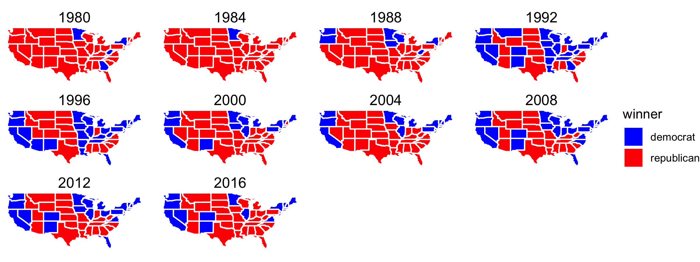
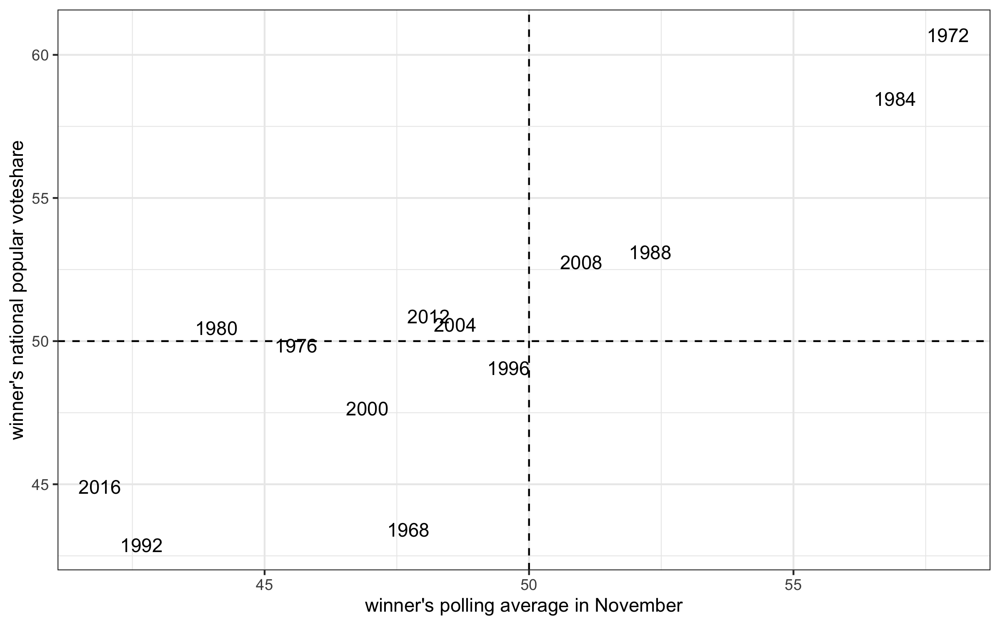

_An example blog for Gov1347_

-------

Welcome to my election prediction blog! It will be updated **every Sunday.** Feel free to reach out to me ([sunyoungpark@g.harvard.edu](sunyoungpark@g.harvard.edu)) if you have any comments and questions.

# Past Presidential Election Results

The prediction of the future is based on the patterns of the past. If X tended to predict Y well, we would want to use that X in our model. So we start our journey by looking into past election results.


We can also see which states vote blue/red and how consistently so.



# How to predict election outcome?

I will try to predict 2020 election outcome using 7 variables: polling results, economic indexes, incumbency, campaign expenditure, mobilization stratetgies, exogenous shocks such as COVID19, and election administration. I use `R` and a simple ordinary least square model.

```r
lm(voteshare ~ polls + econ + incumbency + ads + 
               mobi + covidcases + admin, data)
```

## Polls

Can we trust polls? In 2016, many polls did not expect Trump's win. Below is the polling average across months leading up to 2016 election.


### Pollsters

+ Not all pollsters provide high quality data and interpretation. FiveThirtyEight provides *pollster ratings* based on the accuracy of their past prediction: [https://projects.fivethirtyeight.com/pollster-ratings/](https://projects.fivethirtyeight.com/pollster-ratings/)

+ But it is importnant to note that even good pollsters often disagree. [Same raw data can lead to different predictions by renowned pollsters.](https://www.nytimes.com/interactive/2016/09/20/upshot/the-error-the-polling-world-rarely-talks-about.html)

### Predictive Power

Polls do predict the outcome by and large.



## Economic Forces

1. GDP growth
2. Real Disposable Income
3. Unemployment

For the detailed analysis, please see this [separate page.](econ_analysis.md)

## Incumbency

## Advertising

## Mobilization

## Shocks

See [Healy and Malhotra 2013](healy_review.pdf) and [Ashworth et al. 2017](https://onlinelibrary.wiley.com/doi/abs/10.1111/ajps.12334) for the comprehensive review of the literature.

## Law and Adminisration

-----

### cf. Markdown basics

```markdown
Syntax highlighted code block

# Header 1
## Header 2
### Header 3

- Bulleted
- List

1. Numbered
2. List

**Bold** and _Italic_ and `Code` text

[Link](url) and 
```

For more details see [GitHub Flavored Markdown](https://guides.github.com/features/mastering-markdown/).
