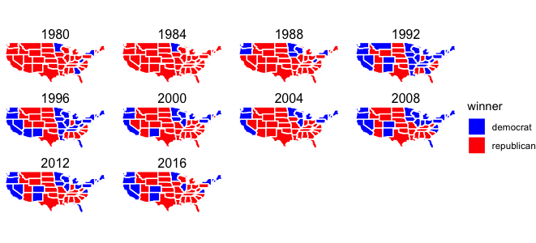

Welcome to my election prediction blog! It's updated every Sunday. Feel free to reach out to me (sunyoungpark@g.harvard.edu) if you have any comments and questions.

# Past Presidential Election Results


We can also see which states vote blue/red and how consistently so.



# How to predict election outcome?

I will try to predict 2020 election outcome using 7 variables: polling results, economic indexes, incumbency, campaign expenditure, mobilization stratetgies, exogenous shocks such as COVID19, and election administration. I use R and a simple ordinary least square model.

## Polls

Can we trust polls? In 2016, many polls did not expect Trump's win. Below is the polling average across months leading up to 2016 election.

### Pollsters

https://projects.fivethirtyeight.com/pollster-ratings/

We have to note that even good pollsters could disagree. [same raw data, four different predictions](https://www.nytimes.com/interactive/2016/09/20/upshot/the-error-the-polling-world-rarely-talks-about.html)

## Economic Forces

## How it works

Students can either (1) use the mardown file of thier team on [our GitHub project repository](https://github.com/Sun-Young-Park/Election-Analytics) to edit their page or (2) upload thier pdf and tag it with the syntax: ```markdown [title](filename.pdf)``` Whenever they commit to this repository, GitHub Pages will run [Jekyll](https://jekyllrb.com/) to rebuild the pages in your site.

### Markdown basics

Markdown is a lightweight and easy-to-use syntax for styling your writing. It includes conventions for

```markdown
Syntax highlighted code block

# Header 1
## Header 2
### Header 3

- Bulleted
- List

1. Numbered
2. List

**Bold** and _Italic_ and `Code` text

[Link](url) and 
```

For more details see [GitHub Flavored Markdown](https://guides.github.com/features/mastering-markdown/).
