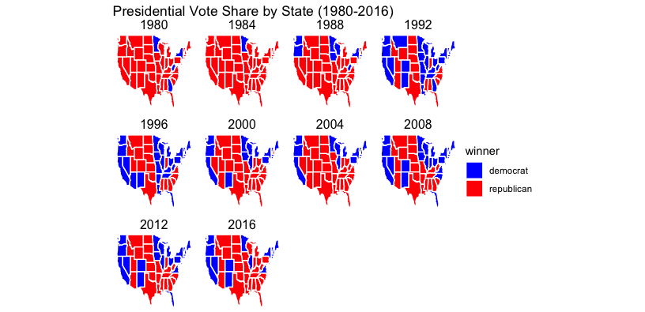
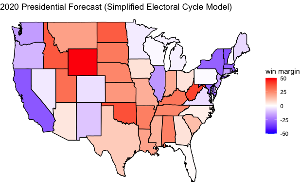

# Introduction: Past Presidential Election Results
## Aug 30, 2020

Predictions of the future are based on the patterns of the past. If X tended to predict Y well in the past, we would want to use that X in our model to predict Y in the future. So we start our journey by looking into past presidential election results -- first two-party voteshare at the national level. We share two main insights and then make a prediction for 2020 based exclusively on past electoral results.

**Elections are generally competitive between the two parties.** One major observation in particular stands out: in the last 60 or so years, the race for the presidency has overall been *remarkably competitive between the two major parties*. By competitive, I mean: since FDR, neither Republicans nor Democrats have maintained a monopoly over the White House, if we look at two-party voteshare:


The first half of the twentieth century experienced greater swings and greater margins of victory, while point spreads (or win margins) in the last 20 years have been less than 10 points. By looks of the first 5 election cycles in the 21st century, it looks like political competition has only <u>increased</u>, not decreased -- both in terms of control of the White House and the narrowness of win margins.

**What are the most "interesting" elections in the last half century?** Some of most interesting -- at least as denoted by the popular media and history textbooks -- elections are hairpin and landslide wins. They, in fact, tend to share some common traits at least in their "prevailing narratives".

The 3 <u>closest</u> elections in the last 60 years are:

* **2000, margin of `0.5%` or 500k votes or `5 EV` (Bush vs. Gore).** Gore managed to distance himself from Clinton's scandals (which put him neck-and-neck with Bush); though, really, this was anyone's election.

* **1960, margin of `0.7%` or 120k votes or `84 EV` (JFK vs. Nixon).** The Republican party was hurt by the 1958 recession (we'll talk about this more when we read [The Message Matters](https://www.amazon.com/Message-Matters-Economy-Presidential-Campaigns/dp/0691139636) by Lynn Vavreck); JFK mobilized a new cohort of Catholic voters; JFK campaigned wisely in key swing states. 

* **1968, margin of `0.7%` or 500k votes or `110 EV` (Nixon vs. Humphrey).** As the South began to re-align, Nixon's [Southern Strategy](https://en.wikipedia.org/wiki/Southern_strategy) appealed to racist whites in the South; beginning of the "culture wars" which favored the Republicans in rural areas; protests against Humphrey for his unpopular pro-war position.

Similarly, the 3 biggest <u>landslides</u> in the last 60 years and their "prevailing narratives" are:

* **1972, margin of `23.5%` or 18 million votes or `503 EV` (Nixon vs. McGovern).** The Republican party was helped by a strong economy; the Republicans continued the Southern Strategy which massively appealed to a newly re-aligned South; McGovern's VP's depression was considered a scandal.

* **1964, margin of `22.6%` or 16 million votes or `434 EV` (Johnson vs. Goldwater).** JFK's assasination considered a shock sympathetic to Dems; despite the beginnings of re-alignment Goldwater portrayed as an extremist in media and campaigns; Johnson's Great Society and Civil Rights reforms were enormous policy achievements.

* **1984, margin of `18.2%` or 17 million votes or `512 EV` (Reagan vs. Mondale).** Reagan enjoyed a post-recession economic recovery; Reagan was an effective ''soundbite'' generator in debates and on the campaign trail.

These are, more or less, the accepted stories about these elections as compiled from various media articles on [Wikipedia](wikipedia.org). They teach us a few things: (1) a strong <span style="color:green">economy</span> can help the incumbent dominate, while a weak one may bring an "underdog" challenger to hairpin win, (2) a few <span style="color:green">tipping point states</span> are thought to be key to deciding in the winner. Conversely, there's mixed evidence about whether <span style="color:brown">shocks</span> really favor/disfavor the incumbent, and whether a candidate's overall <span style="color:brown">message</span> seems to persuade or mobilize voters.

We will explore these topics this semester, what empirical evidence we really have for these "prevailing narratives" heralded by pundits, journalists, historians and many political scientists and whether they generalize beyond these races.

**A winner-take-all system with electors based on population distorts win margins.** We note another set of observations around *the winner's popular vote*. First, very famously in two races, the winner of the popular vote lost the election: Al Gore in 2000 and Hillary Clinton in 2016. This is a reflection of how *each* popular vote for a candidate is not equally valuable to their electoral victory because of the electoral college. The <u>state</u> where it is won matters. 

For example, winning 22 million votes in California (a state with 25 million voting-age citizens) is impressive but unnecessary to beat your opponent and win its 55 electoral votes (`EV`). Call this strategy **A** for those votes:

```
22 million PV = 55 EV (CA)
```

Instead, it would be better if a candidate just won a slim majority of 12.5 million votes in California (`55 EV`), a slim majority of 5 million votes in Pennsylvannia (`20 EV`), and a slim majority of 4.5 million votes in North Carolina (`15 EV`). Call this strategy **B** for those votes:

```
22 million PV = 55 EV (CA) + 20 EV (PA) + 15 EV (NC) = 90 EV
```

That's the same 22 million votes, but in one scenario a candidate wins `55 EV` while in the other a candidate wins `90 EV`. Whoa! 

This is an illustration of the distortions of a **winner-takes-all** electoral system where slim majorities in just a few moderately large states (which promise substantial EVs!) translate to huge electoral gains. Empirically, it ends up that electoral college vote margins [are more dramatic](https://www.pewresearch.org/fact-tank/2016/12/20/why-electoral-college-landslides-are-easier-to-win-than-popular-vote-ones/) than popular vote margins (Desilver 2016). This is why presidential candidates tend to (mostly) focus their resources on moderately large swing states where they can win by a slim majority rather than firing up the base or purusing lost causes. As a result, not all votes in each state are created equal.

Below we can see which states vote blue/red and how consistently so. In section, we will produce more nuanced versions of these maps that highlight the ''swinginess'' of various states.



**Prediction: simplified electoral cycle model.** Noting from the first figure the general competitiveness of elections, we might infer that the best way to predict this year's election in each state is looking at the two *most recent* electoral cycles which are likely to be similarly competitive. 

This is the simple but central engine of the [Helmut Norpath electoral cycle model](https://pollyvote.com/en/naive/electoral-cycle-model/) (Norpoth 2014). I will predict 2020 election state-by-state election outcomes, for each state `i` using a simplified version of this model by taking a weighted average of the past two-party popular voteshares for each party: 

```
Dvoteshare2020_i = (Dvoteshare2016_i x 0.75) + (Dvoteshare2012_i x 0.25)
Rvoteshare2020_i = (Rvoteshare2016_i x 0.75) + (Rvoteshare2012_i x 0.25)
```

See [the related R script to replicate this analysis](../scripts/01-Intro.R). The figure below shows the state-by-state win-margin forecasts (which are `Rvoteshare2020_i - Dvoteshare2020_i`):



(Note that this map could be better labelled!)

If we go on this naive historically weighted model, Trump is expected to win a number of key battleground states: Florida (`+0.7%`), North Carolina (`+3.4%`), Arizona (`+5.2%`), Ohio (`+5.6%`), and Georgia (`+6%`). 

On the other hand, Biden is favored to win a fair share of battelground states including his home-state Pennsylvannia (`+0.8%`), Michigan (`+2.2%`), Wisconsin (`+1.1%`), Minnesota (`+3.3%`), New Hampshire (`+1.7%`), and Maine (`-6.3%`). 

Note that the first three are midwestern states that Obama decisively won by more than `5%` in 2012, and Hillary lost **by less than `1%`** in 2016. Altogether, our simplified electoral cycle model predicts 

* <span style="color:green">Biden: `279 EV`</span>
* Trump:`259 EV`

Amongst many things, this highlights how narrowly Hillary lost the popular vote in a few key states, which translated into an electoral college loss in 2016. Put another way, the electoral college's magnifying effect on the popular vote in this election turned a electoral loser (Trump) into a winner. A precise example of the electoral college's distortion on presidential election results.

